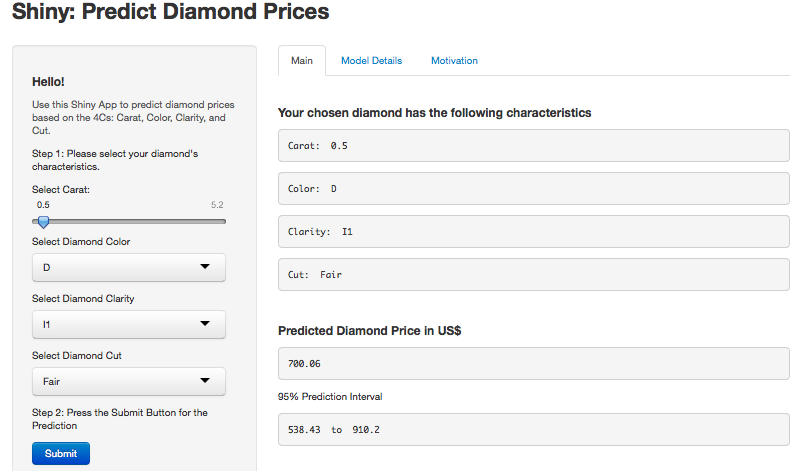

# Introduction & Motivation
One day you find youself wanting to figure out the prices of a number of loose cut diamonds.  You know that each diamond is graded by the [Gemological Institute of America](www.gia.edu) according to four characteristics, namely the **4Cs**
- **carat** weight (of the diamond)
- **color** (grades ranges from J (worst) to D (best))
- **clarity** (grades: I1 (worst), SI1, SI2, VS1, VS2, VVS1, VVS2, IF (best))
- **cut** (grades: Fair, Good, Very Good, Premium, Ideal)

You know that the `ggplot2` package contains a dataset of diamonds and their prices.

```r
library(ggplot2); data(diamonds); head(diamonds)[1:2,]
```

```
##   carat     cut color clarity depth table price    x    y    z
## 1  0.23   Ideal     E     SI2  61.5    55   326 3.95 3.98 2.43
## 2  0.21 Premium     E     SI1  59.8    61   326 3.89 3.84 2.31
```

--- .class #id

## Model
You decide to build a `lm` model.  As you have the loose diamonds' GIA certifications with you, you can read the **4Cs**  into the model. The dataset also contains physical measurements of the size of the diamond.  However, since you know that weight is directly related to the diamond's volume (and also that you do not have good quality rulers with you), you decide not to use the dimension variables. 

First you ensure that each variable is of the correct class 
* `price` and `carat` variables are `numeric`, and
* `clarity`, `cut` and `color` variables as `factor`

Then you build the simple linear regression model.

```r
fit.4C<-lm(log(price) ~ log(carat) + color + clarity + cut, data=ddata)
summary(fit.4C)$r.squared # this gives the adjusted R-squared value for the model.
```

```
## [1] 0.9826
```

--- .class #id

## Prediction
You decide to build the following function to help make predictions (including a 95% Prediction Interval). 

```r
ModOut<-function(carat,color,clarity,cut)  {
  user.input<-data.frame(carat,color,clarity,cut)
  user.input$carat<-as.numeric(user.input$carat)
  PredFit<-predict(fit.4C,newdata=user.input, interval="prediction")
  round(exp(PredFit),2)
}
# Test Prediction.  Key in required diamond attributes here.  For example
ModOut(0.5,"D","I1","Fair")
```

```
##     fit   lwr   upr
## 1 700.1 538.4 910.2
```

--- .class #id

## Shiny APP

Making the model [interactive via Shiny](http://rpadawan.shinyapps.io/diamonds/). 

Here's a screenshot. Go to the Shiny App and try it out!



